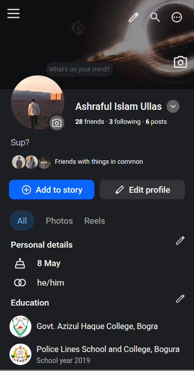
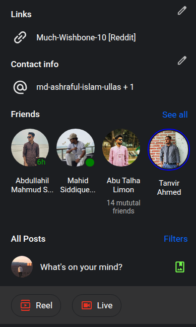
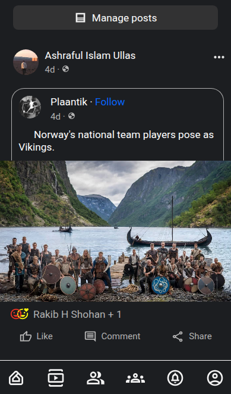

# Facebook Mobile Profile Clone

A Facebook mobile profile page clone built using HTML and CSS.
This project recreates Facebook's mobile profile layout, including the cover photo, profile picture, personal information, friends section, posts section, and bottom navigation bar.

### Features

- Cover photo with overlay icons
- Profile picture overlapping the cover photo
- User information section
- Add Story and Edit Profile buttons
- Personal details and education section
- Friends section with active indicators
- Post creation area
- Sample feed post with reactions
- Fixed bottom navigation bar

### Built With

- HTML5
- CSS3
- Google Fonts (Roboto)

### How to View

This project was designed for mobile screens.

1. Open the project in your browser.
2. Right-click and select Inspect.
3. Enable Device Toolbar.
4. Choose Samsung Galaxy S8+.
5. Refresh the page if needed.

### What I Practiced

- Flexbox
- CSS Grid
- Relative & Absolute Positioning
- Fixed Navigation
- Z-Index
- Mobile-First Layout Design

### Project Goal

The goal of this project was to improve my HTML and CSS skills by recreating a real-world social media interface without using JavaScript or any frameworks.

### Project Screenshot

1. 

2. 

3. 

